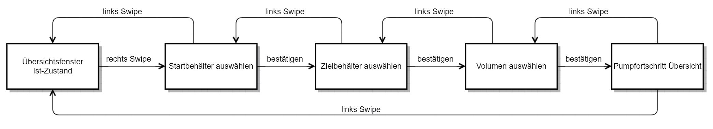

# Control by Gesture

Repsoitory for iAT Control by Gesture project during WS21/22 at ifA TU Dresden.

## How to run
Requirments: Python>=3.7 (has only been tested with Python3.8 but 3.7 should work as well)

### 0. Install dependencies

1. Download Kinect for Windows Runtime 2.2.1811 (https://www.microsoft.com/en-us/download/details.aspx?id=57578)
2. Install vcredist_x64.exe
3. Install kinectsensor.inf
4. Install KinectRuntime-x64.msi
5. Download Kinect for Windows SDK 2.0 (https://www.microsoft.com/en-us/download/details.aspx?id=44561)
6. Install KinectSDK-v2.0_1409-Setup.exe
7. pip install -r requirements.txt
8. see [Problem solving section](#4-bugs-and-how-to-solve-them)

When using a virtual environment activate it:
```cmd
.\venv\Scripts\activate
```
### 1. Run the mock server (only necessary when official server is not available)
1.1 Navigate into server folder
```cmd
cd .\server\
```

1.2 Run server.py with python
```cmd
python .\server.py
```

### 2. Run the client
2.1 Set `kinect_connected` in `main.py` to `True` if you want to run the client with the kinect
or to `False` if you just want to try the client-server interaction and the frontend.

2.2 Set `self.simulation` in `main.py` to `True` if you want to use the mock server instead 
of the official IfA "Kleinversuchsanlage" Server or to `False` otherwise.

2.3 Run main.py with python
```cmd
python .\main.py
```

### 3. Possible Gestures and Control Flow:
#### Possible gestures:
**left hand:**
- swipe left to change to next frame, only possible when on starting view  
- swipe right to change back to previous frame, when pumping it stops pumping and returns to starting view instead

**right hand:**
- when not confirming a selection leave hand open!
- selecting a tank:
  - select tank via right hand x-movment
  - confirm selected tank by closing open hand
- choosing a volume:
  - choose volume by moving open hand up and down
  - confirm selected volume by closing open hand

#### Control Frame Overview:
View with white background to have readable text!


### 4. Bugs and how to solve them
PyKinect2 is not maintained anymore, here are 2 common fixes you should apply after install.  
Python3.8 compatibility issues: https://github.com/Kinect/PyKinect2/pull/87  
PyPi outdated package, follow this comment to fix: https://github.com/Kinect/PyKinect2/issues/37#issuecomment-290158054  

## Licence
The Repository has been published under the MIT license. The details can be viewed in the [LICENSE file](LICENSE)
